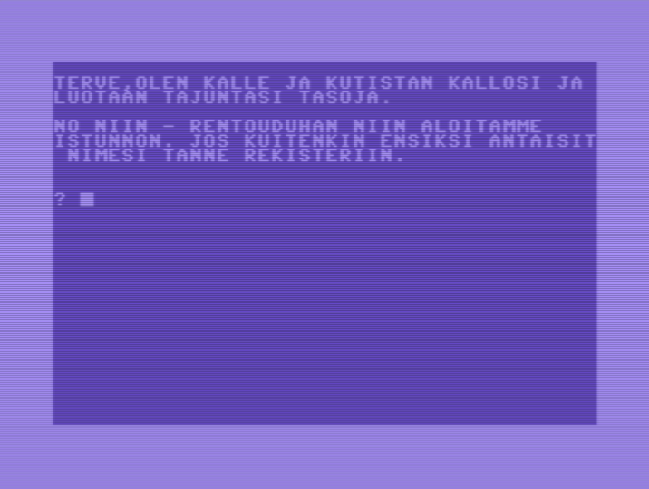

# Kalle Kotipsykiatri C64

Kalle Kotipsykiatri Commodore 64 Basic source code.

Kalle Kotipsykiatri is a Finnish-language conversational computer program, or chatbot, which gave the impression of artificial intelligence. Originally written for the Apple II computer in 1982 by Pekka Tolonen, and ported for Commodore 64 in 1984 by Jyrki Kasvi [^1].

The source code is hand copied from the program listing published in MikroBitti magazine 1/1984 [^2]. Minor fixes to the source code has been made as the original program listing in the Magazine contained bugs making the program unrunnable. [^1]

[^1]: Wikipedia (in Finnish) https://fi.wikipedia.org/wiki/Kalle_Kotipsykiatri
[^2]: Kasvi, Jyrki J. J.: Kalle Kotipsykiatri. MikroBitti, 1984, issue 1.
